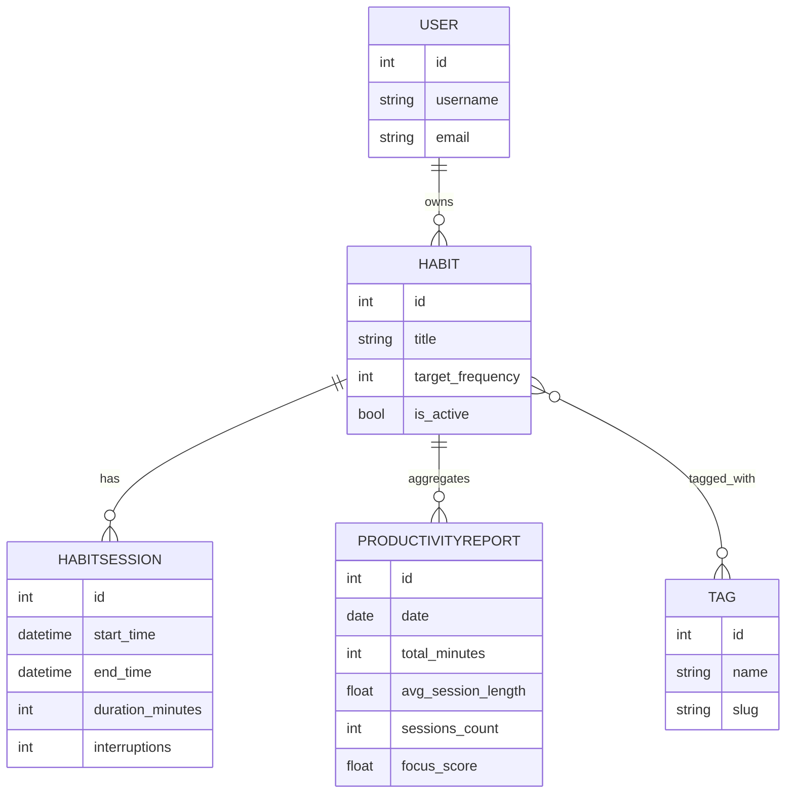

Техническое задание на проект: Веб-сервис анализа привычек пользователя для расчёта персонального уровня продуктивности и выявления факторов прокрастинации

1. Название и концепция

Название: Веб-сервис анализа привычек пользователя для расчёта персонального уровня продуктивности и выявления факторов прокрастинации

Краткая концепция: Сервис позволяет пользователю регистрировать повседневные привычки и сессии выполнения задач (временные блоки). На основе исторических данных система вычисляет метрики продуктивности (время концентрации, средняя частота выполнения привычки, доля выполнения целей) и визуализирует результаты в виде интерактивных графиков. Сервис также выделяет возможные факторы прокрастинации (например, частые прерывания, низкая длительность сессий, несоответствие времени суток).

2. Целевая аудитория и роли

Целевая аудитория: Люди, желающие отслеживать и анализировать свои рабочие и жизненные привычки для повышения продуктивности.

Роли:
- Гость: может просматривать публичную информацию и общую демо-страницу с примерами графиков.
- Пользователь (ordinary user): может регистрироваться, создавать/редактировать/удалять свои привычки, логировать сессии, смотреть личные отчёты и графики.
- Администратор (admin): управляет системой, модерацией контента и имеет расширённый доступ к данным (через кастомный интерфейс, не стандартную Django admin-панель для входа/CRUD).

Примечание: Вход/регистрация/CRUD-интерфейсы будут полностью кастомными — ни пользователь, ни админ не должны видеть дефолтный Django admin UI при обычной работе.

3. Модели данных (минимум 3 кастомные модели)

Модель `Habit` (Привычка): описание привычки пользователя.
- `id` (AutoField)
- `user` (ForeignKey -> auth.User)
- `title` (CharField)
- `description` (TextField, optional)
- `target_frequency` (IntegerField) — желаемое количество раз в неделю
- `is_active` (BooleanField)
- `tags` (ManyToManyField -> Tag)
- `created_at`, `updated_at` (DateTime)

Модель `HabitSession` (Сессия/лог выполнения привычки): записи о фактическом выполнении.
- `id` (AutoField)
- `habit` (ForeignKey -> Habit, related_name='sessions')
- `user` (ForeignKey -> auth.User) — дублируется для быстрого доступа и безопасности
- `start_time` (DateTimeField)
- `end_time` (DateTimeField)
- `duration_minutes` (IntegerField, computed on save)
- `interruptions` (IntegerField) — число прерываний
- `notes` (TextField, optional)

Модель `Tag` (Метка для привычек)
- `id` (AutoField)
- `name` (CharField)
- `slug` (SlugField)

Дополнительная модель `ProductivityReport` (предварительно вычислённые агрегаты, опционально)
- `id`
- `user` (ForeignKey -> auth.User)
- `date` (DateField) — день отчёта
- `total_minutes` (Integer)
- `avg_session_length` (Float)
- `sessions_count` (Integer)
- `focus_score` (Float) — вычисленная метрика продуктивности
- `created_at`

Схема связей:
- `Habit` 1..N `HabitSession`
- `Habit` N..M `Tag`
- `User` 1..N `Habit`

4. Основные сценарии пользователя (User Stories)

* Регистрация и логин: Пользователь регистрируется (email + пароль), логинится и попадает на дашборд со сводными метриками.
* CRUD привычек: Пользователь создаёт новую привычку с целевой частотой и метками, редактирует и удаляет её через формы (ModelForm) с валидацией.
* Логирование сессий: Для каждой привычки пользователь добавляет сессию (время начала и окончания, число прерываний, заметки). Система сохраняет сессию и автоматически рассчитывает `duration_minutes`.
* Отчёты и визуализация: Система предобрабатывает данные (агрегирует за день/неделю/месяц с помощью Django ORM и Pandas), строит графики (Chart.js) — распределение времени, динамика среднего времени сессии, heatmap по времени суток.
* API и CRUD: Для каждой модели будет REST API (Django REST Framework) с полными CRUD-эндпоинтами для фронтенда и потенциального мобильного клиента.

5. Технический стек и интеграции

- Backend: Django 4.x, Django REST Framework
- Database: SQLite (db.sqlite3 для разработки; при деплое на PythonAnywhere также SQLite)
- Frontend: Django templates, Tailwind CSS ("django"-style integration without Node — clarify preferred method), Chart.js for interactive charts
- Data analysis: Pandas for precomputations and more advanced aggregation (Avg, Sum, rolling means)
- Other: requests (optionally) to fetch external benchmark data or schedule info (optional)

6. Дополнительные технические детали

- Агрегации: использовать Django ORM агрегаты (Count, Sum, Avg) и продвинутые запросы (Subquery, Q, conditional annotations) для предвычисления при создании `ProductivityReport` или в отдельных management commands / celery tasks (в MVP — management command + periodic runner manual).
- Авторизация/Роли: использовать Django `auth.User` + `is_staff`/`is_superuser` для админа, и vlastní `UserProfile` если потребуется расширение. Вход будет реализован собственными view/form, не дефолтным админ-панелем.
- Безопасность: никаких секретов в коде; настройка `SECRET_KEY` через env переменные при деплое; DEBUG выключается для продакшна.

7. Данные для демонстрации

- Планируется добавить fixtures или management command для генерации 10-15 тестовых записей (несколько пользователей, ~5 привычек и ~50 сессий) для видимой демонстрации графиков и агрегатов.

8. Изменения в ходе реализации

(Этот раздел будет обновлён при значимых отклонениях от текущего ТЗ)

9. ER-диаграмма (схема связей моделей)

Ниже — Mermaid ER-диаграмма связей между основными сущностями.

Entities:
- User: стандартная модель auth.User
- Habit: принадлежит User, имеет M2M на Tag
- HabitSession: FK -> Habit, FK -> User (для быстрого доступа)
- Tag: метки для привычек
- ProductivityReport: предварительно вычисляемые агрегаты по пользователю и дате

10. Подробные Use Case сценарии и алгоритмы

Use Case 1 — Регистрация и вход
- Actors: Гость
- Предусловия: пользователь имеет email и пароль
- Шаги:
	1. Пользователь открывает страницу регистрации.
	2. Вводит email, пароль, подтверждение пароля (валидация на `UserCreationForm` и кастомной форме).
	3. На успешную регистрацию создаётся User и происходит автоматический вход.
- Результат: Redirect на личный дашборд.

Use Case 2 — CRUD привычек
- Actors: Пользователь
- Предусловия: пользователь аутентифицирован
- Шаги:
	1. Пользователь открывает список привычек (`/habits/`).
	2. Нажимает "Создать привычку" — открывается `HabitForm` (ModelForm) с полями: title, description, target_frequency, tags, is_active.
	3. Валидация: `title` required, `target_frequency` >= 0.
	4. При сохранении создаётся `Habit` с `user=request.user`.
	5. Редактирование/удаление реализуется аналогично.
- API: CRUD endpoints `/api/habits/` с правами только для владельца.

Use Case 3 — Логирование сессии (HabitSession)
- Actors: Пользователь
- Шаги:
	1. Открывает страницу привычки и нажимает "Добавить сессию".
	2. Вводит `start_time`, `end_time`, `interruptions`, `notes`.
	3. Серверная валидация: `end_time > start_time`; `interruptions >= 0`.
	4. При сохранении модель автоматически вычисляет `duration_minutes = int((end_time - start_time).total_seconds() / 60)` в `save()` или через signal.
	5. После создания сессии триггерится обновление агрегатов: пересчёт дневного `ProductivityReport` для пользователя и даты `start_time.date()`.

Use Case 4 — Генерация дашборда и визуализация
- Actors: Пользователь
- Шаги:
	1. Пользователь переходит на `/dashboard/`.
	2. Сервер собирает агрегаты: суммарное время за выбранный период, средняя длина сессии, количество сессий, показатели по тэгам.
	3. Для интерактивных графиков фронтенд запрашивает `/api/reports/summary/?range=30d` и получает JSON с временной серией.
	4. Chart.js визуализирует данные; Heatmap по часу суток строится на основе группировки `EXTRACT(hour FROM start_time)`.

Algorithm — предвычисление отчётов (management command `compute_reports`):
- Для каждого пользователя и каждого дня в периоде:
	- Собрать `sessions = HabitSession.objects.filter(user=user, start_time__date=day)`
	- Вычислить `total_minutes = Sum('duration_minutes')`, `sessions_count = Count('id')`, `avg_session_length = Avg('duration_minutes')`, `avg_interruptions = Avg('interruptions')` через ORM-агрегации.
	- Рассчитать `focus_score` как взвешенная метрика. Пример формулы:

$$
focus\_score = 100 * \frac{\min(\text{avg\_session\_length}, 120)}{120} * \left(1 - \frac{\text{avg\_interruptions}}{(\text{sessions\_count} + 1)}\right)
$$

	- Записать/обновить `ProductivityReport(user=user, date=day, total_minutes=..., avg_session_length=..., sessions_count=..., focus_score=... )`.
	- Для скользящих метрик (7/14/30 дней) использовать `pandas` для расчёта rolling-averages по time-series; в MVP можно комбинировать ORM и Pandas для выбранных периодов.

Use Case 5 — Администрирование (кастомный интерфейс)
- Actors: Admin
- Шаги:
	1. Admin логинится через кастомную страницу администратора (не дефолтный `/admin/`).
	2. Имеет доступ к списку пользователей, привычек и сессий и может выполнять CRUD через собственный UI.

11. План автоматического тестирования (цели и приоритеты)

Цель: покрыть бизнес-логику тестами, чтобы изменения в агрегациях и подсчётах были безопасными.

Обязательные тесты:
- `tests/test_models.py`:
	- Проверка корректного вычисления `duration_minutes` при сохранении `HabitSession`.
	- Проверка ограничения: `end_time > start_time`.
	- Тест для `ProductivityReport` — создание сессий и проверка расчётных агрегатов и `focus_score`.
- `tests/test_aggregations.py`:
	- Тест management command `compute_reports`: генерируем фикстуры и проверяем, что `ProductivityReport` созданы с ожидаемыми значениями, включая rolling averages (если реализованы).
- `tests/test_api.py`:
	- Тесты CRUD для `/api/habits/` и `/api/sessions/` с использованием `APIClient` и проверкой прав доступа (только владелец может модифицировать).
- `tests/test_views.py` (интеграционные):
	- Проверка, что дашборд возвращает корректный контекст и что Chart.js получает корректные JSON-ответы.

Автоматизация CI (опционально): добавить GitHub Actions workflow для запуска `pytest` и линтинга при push.

12. Изменения в ходе реализации

Любые существенные отклонения от описанного ТЗ будут документироваться ниже с датой и коротким описанием причин.

--